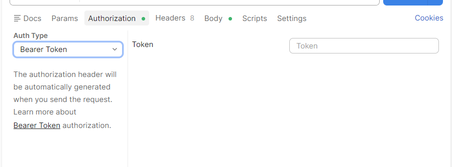

# 接口

## 约定

使用小驼峰

ID全大写，比如userID

时间戳用13位

token放在header里


## 机器人接口

## 用户接口

### 用户注册/登陆

路由：/api/user/token
请求类型：post
是否需要token：否
请求体：
```json
{
    "phonenumber":"123123", //手机号
    "code":"123456" //验证码
}
```
返回体：
```json
{
    "code":200, //状态码
    "data":{
        "token":"21456",//token
        "userID":"2313" //uuid
    }, 
    "msg":"123456" //msg
}
```

### 用户绑定机器人

路由：/api/user/robot/bind
请求类型：post
是否需要token：是
请求体：
```json
{
    "userID":"123123", //uuid
    "robotID":"123456", //机器人编码（确定机器人唯一的东西）
    "personalityID":123,//初始人格ID
    "toneID":123//音色id
}
```
返回体：
```json
{
    "code":200, //状态码
    "data":{
    }, 
    "msg":"123456" //msg
}
```

### 用户解绑机器人

路由：/api/user/robot/unbind
请求类型：delete
是否需要token：是
请求体：
```json
{
    "userID":"123123", //uuid
    "robotID":"123456" //机器人编码（确定机器人唯一的东西）
}
```
返回体：
```json
{
    "code":200, //状态码
    "data":{
    }, 
    "msg":"123456" //msg
}
```

### 获取用户信息

路由：/api/user/{userID}/info
请求类型：get
是否需要token：是
请求体：
```json
{
}
```
返回体：
```json
{
    "code":200, //状态码
    "data":{
        "phonenumber":"123123", //手机号
        "userID":"2313", //uuid
        "userName":"123465",//用户名
        "avatar":"123132"//用户头像路径
    }, 
    "msg":"123456" //msg
}
```

### 修改用户信息

路由：/api/user/{userID}/info/change
请求类型：get
是否需要token：是
请求体：
```json
{
    "phonenumber":"123123", //手机号
    "userID":"2313", //uuid
    "userName":"123465",//用户名
    "avatar":"123132",//用户头像路径
    "code":"123456" //验证码
}
```
返回体：
```json
{
    "code":200, //状态码
    "data":{
    }, 
    "msg":"123456" //msg
}
```

### 获取用户所属的机器人

路由：/api/user/{userID}/robot
请求类型：get
是否需要token：是
请求体：
```json
{
}
```
返回体：
```json
{
    "code":200, //状态码
    "data":{
        "robotList":[
            {
                "robotCode":"123456", //机器人编码（确定机器人唯一的东西）
                "robotName":"123"//用户给的昵称
            }
        ]
    }, 
    "msg":"123456" //msg
}
```

## 机器人接口

### 获取机器人人格信息

路由：/api/robot/{robotID}/personality
请求类型：get
是否需要token：是
请求体：
```json
{
}
```
返回体：
```json
{
    "code":200, //状态码
    "data":{
        "mbti":[
            "E":88, 
            "I":12,
            "S":12,
            "N":88,
            "T":12,
            "N":88,
            "J":45,
            "P":55//注意两两相对，求和为100
        ],
        "big5":[
            "neuroticism":123,//神经质
            "extraversion":1,//外倾性
            "openness":1,//开放性
            "agreeableness":1,//宜人性
            "conscientiousness":1//尽责性
        ]
    }, 
    "msg":"123456" //msg
}
```

### 获取机器人部分原始对话记录

路由：/api/robot/{robotID}/message/{cursor}/{limit}
请求类型：get
是否需要token：是
请求体：
```json
{
}
```
返回体：
```json
{
    "code":200, //状态码
    "data":{
        "messageList":[
            {
                "messageID":"123",//uuid
                "createdAt":123132132,//13位时间戳
                "content":"123465465",//原始信息
                "belong":"7894896465"//userID或robotID来表示这句话是谁说的
            }
        ],
        "meta": {
            "nextCursor": "1055",  // 下一页请求时应该传入的 cursor 值
            "hasMore": true        // 是否还有更多历史记录 (true/false)
        }
    }, 
    "msg":"123456" //msg
}
```

### 获取机器人部分摘要内容

路由：/api/robot/{robotID}/abstract/{cursor}/{limit}
请求类型：get
是否需要token：是
请求体：
```json
{
}
```
返回体：
```json
{
    "code":200, //状态码
    "data":{
        "abstractList":[
            {
                "abstractID":"123",//uuid
                "createdAt":123132132,//13位时间戳
                "content":"123465465",//摘要信息
            }
        ],
        "meta": {
            "nextCursor": "1055",  // 下一页请求时应该传入的 cursor 值
            "hasMore": true        // 是否还有更多历史记录 (true/false)
        }
    }, 
    "msg":"123456" //msg
}
```

### 修改机器人人格

路由：/api/robot/{robotID}/personality/change
请求类型：put
是否需要token：是
请求体：
```json
{
    "robotID":"123",
    "mbti":[
            "E":88, 
            "I":12,
            "S":12,
            "N":88,
            "T":12,
            "N":88,
            "J":45,
            "P":55//注意两两相对，求和为100
    ],
    "big5":[
        "neuroticism":123,//神经质
        "extraversion":12,//外倾性
        "openness":12,//开放性
        "agreeableness":1,//宜人性
        "conscientiousness":3//尽责性
    ]
}
```
返回体：
```json
{
    "code":200, //状态码
    "data":{
    }, 
    "msg":"123456" //msg
}
```

### 修改机器人音色

路由：/api/robot/{robotID}/tone/change
请求类型：put
是否需要token：是
请求体：
```json
{
    "robotID":"123",
    "toneID":123//音色id
}
```
返回体：
```json
{
    "code":200, //状态码
    "data":{
    }, 
    "msg":"123456" //msg
}
```

### 获取机器人的用户画像

路由：/api/robot/{robotID}/userportrait
请求类型：get
是否需要token：是
请求体：
```json
{
}
```
返回体：
```json
{
    "code":200, //状态码
    "data":{
        "userPortraitList":[
            {
                "portraitID":"123456",//画像id
                "avatar":"用户画像头像路径"
            }
        ]
    }, 
    "msg":"123456" //msg
}
```

### 查看机器人的某一个具体用户画像

路由：/api/robot/{robotID}/userportrait/{portraitID}
请求类型：get
是否需要token：是
请求体：
```json
{
}
```
返回体：
```json
{
    "code":200, //状态码
    "data":{
        "userPortrait":{
            "portraitID":"123456",//画像id
            "avatar":"用户画像头像路径",
            "createdAt":123132132,//13位时间戳
            "updatedAt":123132132,//13位时间戳
            "userName":"用户昵称",
            "age":12,
            "profession":"用户职业",
            "mbti":[
                "E":88, 
                "I":12,
                "S":12,
                "N":88,
                "T":12,
                "N":88,
                "J":45,
                "P":55//注意两两相对，求和为100
            ],
            "big5":[
                "neuroticism":123,//神经质
                "extraversion":1,//外倾性
                "openness":1,//开放性
                "agreeableness":1,//宜人性
                "conscientiousness":1//尽责性
            ],
            "familyTies":"用户的家庭关系"
        }
    }, 
    "msg":"123456" //msg
}
```

### 获取机器人的家庭画像

路由：/api/robot/{robotID}/familyportrait
请求类型：get
是否需要token：是
请求体：
```json
{
}
```
返回体：
```json
{
    "code":200, //状态码
    "data":{
        "familyPortrait":{
            "familyID":"123456",//画像id
            "createdAt":123132132,//13位时间戳
            "updatedAt":123132132,//13位时间戳
            "content":"内容"
        }
        
    }, 
    "msg":"123456" //msg
}
```

### 获取全部机器人音色

路由：/api/robot/{robotID}/tone
请求类型：get
是否需要token：是
请求体：
```json
{
}
```
返回体：
```json
{
    "code":200, //状态码
    "data":{
        "toneList":[
            {
                "toneID":12,
                "toneName":"123"
            }
        ]
    }, 
    "msg":"123456" //msg
}
```

### 获取全部机器人初始人格

路由：/api/robot/{robotID}/initPersonality
请求类型：get
是否需要token：是
请求体：
```json
{
}
```
返回体：
```json
{
    "code":200, //状态码
    "data":{
        "personalityList":[
            {
                "personalityID":12,
                "personalityName":"123"
            }
        ]
    }, 
    "msg":"123456" //msg
}
```

### 获取全部机器人技能

路由：/api/robot/{robotID}/skill
请求类型：get
是否需要token：是
请求体：
```json
{
}
```
返回体：
```json
{
    "code":200, //状态码
    "data":{
        "skillList":[
            {
                "skillID":12,
                "skillName":"123"
            }
        ]
    }, 
    "msg":"123456" //msg
}
```